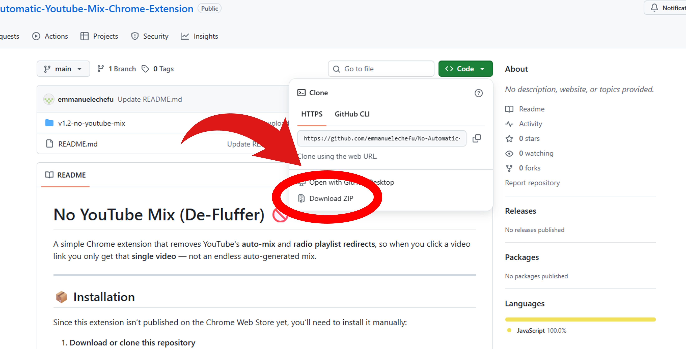

# No YouTube Mix (De-Fluffer) 🚫

A simple Chrome extension that removes YouTube's **auto-mix** and **radio playlist redirects**, so when you click a video link you only get that **single video** — not an endless auto-generated mix.

---

## 📦 Installation

Since this extension isn’t published on the Chrome Web Store yet, you’ll need to install it manually:

1. **Download or clone this repository**

Press the green code button and click "Download Zip"

  

2. **Open Chrome Extensions settings**
   
   Go to:  

       chrome://extensions

4. **Enable Developer Mode**  
   Toggle the **Developer mode** switch in the top-right corner.

5. **Load the extension**  
   - Click **Load unpacked**  
   - Select the folder you downloaded/cloned.

6. ✅ Done! The extension will now run in the background and automatically clean YouTube links.

---

## Features
- Strips out YouTube’s `list=RD...` auto-mix playlist parameters.
- Removes the `start_radio` flag that triggers auto-radio playback.
- Works with both `youtube.com` and `youtu.be` links.
- Redirects in both full navigations and single-page-app (SPA) YouTube transitions.

---

## How It Works
- **`background.js`** intercepts navigation events and rewrites YouTube links by removing `list=RD...` and `start_radio` parameters.
- **`rules.json`** defines a declarative rule to automatically drop the `start_radio` parameter.
- **`manifest.json`** registers the extension with required permissions and icons.

---

## Permissions Used
- `webNavigation` + `tabs`: to catch YouTube redirects and SPA transitions.
- `declarativeNetRequest`: to filter out unwanted URL parameters.
- Host permissions for `youtube.com` and `youtu.be`.

---

Pull requests and improvements are welcome! Feel free to fork, tweak, and submit a PR.

---

## License
MIT License © 2025 [Emmanuel Echefu](https://github.com/emmanuelechefu)
